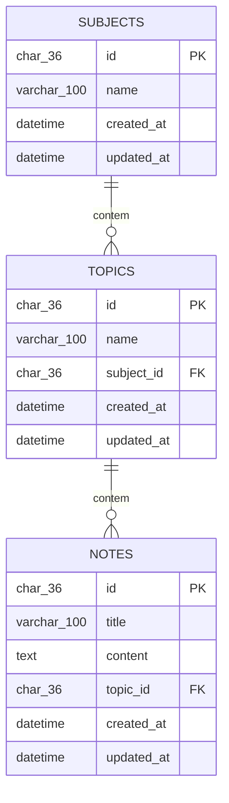

# 📚 study_site

> Um app de notas de estudo construído do zero em Python — pensado, modelado e refatorado enquanto aprendo.


---

## 🧭 Sobre o projeto

`study_site` é uma aplicação para organizar o conhecimento em três níveis: **Assuntos (Subjects)**, **Tópicos (Topics)** dentro desses assuntos, e **Notas (Notes)** dentro de cada tópico.

A ideia nasceu de uma necessidade real: organizar anotações de estudo de forma estruturada, em vez de arquivos soltos.

Este projeto está **ativamente em construção** e é, antes de tudo, um exercício de aprendizado. Ele não nasceu de um framework pronto — cada decisão de modelagem, cada escolha de tipo de dado e cada camada de arquitetura é pensada e discutida deliberadamente, com o objetivo de entender o *porquê*, não apenas o *como*.

Se você acompanhar o histórico de commits, verá que o projeto evoluiu em etapas:

1. Modelagem das entidades em Python puro (classes simples, sem framework).
2. Implementação de operações CRUD **in-memory** para validar a lógica de negócio isoladamente.
3. Modelagem do banco de dados relacional no MySQL Workbench.
4. Início da construção da camada de **persistência**, utilizando o Repository Pattern para traduzir as operações Python para SQL.

---

## 🗂️ Modelo de dados

As três entidades possuem uma relação hierárquica clara: um `Subject` agrupa vários `Topics`, e cada `Topic` agrupa várias `Notes`.



### Classes Python correspondentes

```python
class Subject:
    def __init__(self, id, name, created_at, updated_at):
        self.id = id
        self.name = name
        self.created_at = created_at
        self.updated_at = updated_at


class Topic:
    def __init__(self, id, name, subject_id, created_at, updated_at):
        self.id = id
        self.name = name
        self.subject_id = subject_id
        self.created_at = created_at
        self.updated_at = updated_at


class Note:
    def __init__(self, id, title, content, topic_id, created_at, updated_at):
        self.id = id
        self.title = title
        self.content = content
        self.topic_id = topic_id
        self.created_at = created_at
        self.updated_at = updated_at
```

---

## 🏛️ Decisões de arquitetura

Algumas escolhas foram feitas conscientemente durante o desenvolvimento:

| Decisão                                                 | Por quê                                                                                                                                                                                                                    |
| ------------------------------------------------------- | -------------------------------------------------------------------------------------------------------------------------------------------------------------------------------------------------------------------------- |
| **IDs como UUID (`CHAR(36)`)**                          | Gerados pela aplicação com `uuid.uuid4()`, permitindo que os identificadores sejam criados independentemente do banco.                                                                                                     |
| **Datas em UTC, geradas em Python**                     | A aplicação é responsável por determinar os timestamps, mantendo um padrão consistente entre aplicação e banco de dados.                                                                                                   |
| **`TEXT` para o conteúdo das notas**                    | O corpo de uma nota de estudo pode crescer bastante, tornando `TEXT` mais adequado do que um `VARCHAR` com limite fixo.                                                                                                    |
| **Repository Pattern na camada de persistência**        | As classes de domínio (`Subject`, `Topic`, `Note`) permanecem independentes da camada de persistência. A comunicação com o banco fica isolada nos repositórios (`SubjectRepository`, `TopicRepository`, `NoteRepository`). |
| **Foreign Keys com `ON DELETE`/`ON UPDATE` explícitos** | A integridade referencial é garantida pelo próprio banco: um `Topic` depende de um `Subject` válido, e uma `Note` depende de um `Topic` válido.                                                                            |

---

## 🏗️ Arquitetura

A camada de domínio é mantida separada da camada responsável pelo acesso ao banco:

```text
Python Domain Models
        │
        ▼
   Repositories
        │
        ▼
       MySQL
```

As entidades não precisam conhecer SQL ou detalhes específicos do banco de dados. Os repositórios são responsáveis por transformar as operações da aplicação em operações SQL.

---

## ⚙️ Stack tecnológica

* **Linguagem:** Python
* **Banco de dados:** MySQL
* **Engine:** InnoDB
* **Encoding:** `utf8mb4`
* **Modelagem:** MySQL Workbench
* **Driver de conexão:** *(a definir — `mysql-connector-python` ou `PyMySQL`)*
* **Padrão de persistência:** Repository Pattern

---

## 📌 Status atual

* [x] Modelagem das entidades `Subject`, `Topic` e `Note`
* [x] Implementação de CRUD in-memory
* [x] Modelagem relacional do banco (tabelas, PKs e FKs)
* [ ] Camada de persistência (repositórios traduzindo Python → SQL)
* [ ] Tratamento de erros e validações
* [ ] Testes automatizados
* [ ] Interface de uso (CLI ou web)

> Este roadmap é vivo — as próximas etapas podem mudar conforme o aprendizado avança.

---

## 🧩 Estrutura de pastas

A estrutura abaixo representa a organização planejada para a camada de persistência:

```text
study_site/
├── models/
│   ├── subject.py
│   ├── topic.py
│   └── note.py
├── repositories/
│   ├── subject_repository.py
│   ├── topic_repository.py
│   └── note_repository.py
└── db/
    └── connection.py
```

Essa estrutura poderá mudar conforme novas necessidades surgirem durante o desenvolvimento.

---

## 🚀 Como executar localmente

> ⚠️ Seção em construção — os passos abaixo serão detalhados conforme a camada de persistência avança.

```bash
# Clonar o repositório
git clone https://github.com/seu-usuario/study_site.git
cd study_site

# Criar e ativar um ambiente virtual
python -m venv venv
source venv/bin/activate  # ou venv\Scripts\activate no Windows

# Instalar dependências
pip install -r requirements.txt

# Configurar o banco de dados (MySQL) e variáveis de ambiente
# Detalhes de configuração serão adicionados em breve.
```

> **Nota:** credenciais do banco de dados não devem ser armazenadas diretamente no repositório. A configuração será feita por meio de variáveis de ambiente.

---

## 📖 Aprendizados até aqui

Este projeto funciona como um laboratório para consolidar conceitos de backend e modelagem de dados.

Entre os principais aprendizados até o momento:

* A diferença prática entre `CHAR` e `VARCHAR`, e quando cada um faz sentido.
* Como desenhar chaves estrangeiras corretamente.
* Como a integridade referencial funciona no banco de dados.
* A separação entre lógica de domínio e acesso a dados.
* Como o Repository Pattern pode isolar a aplicação dos detalhes de persistência.
* A geração de identificadores com UUID.
* O uso consistente de timestamps em UTC.
* A transformação de operações realizadas em Python em operações SQL.

---

## 🙋 Autor

Feito por **Alberto Franca**, enquanto estuda desenvolvimento back-end em Python.

---

<p align="center"><i>Projeto em constante evolução — feedback e sugestões são bem-vindos! 🌱</i></p>
